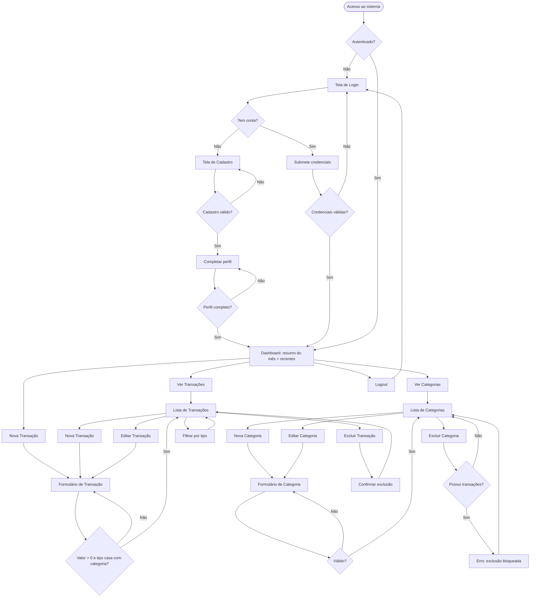
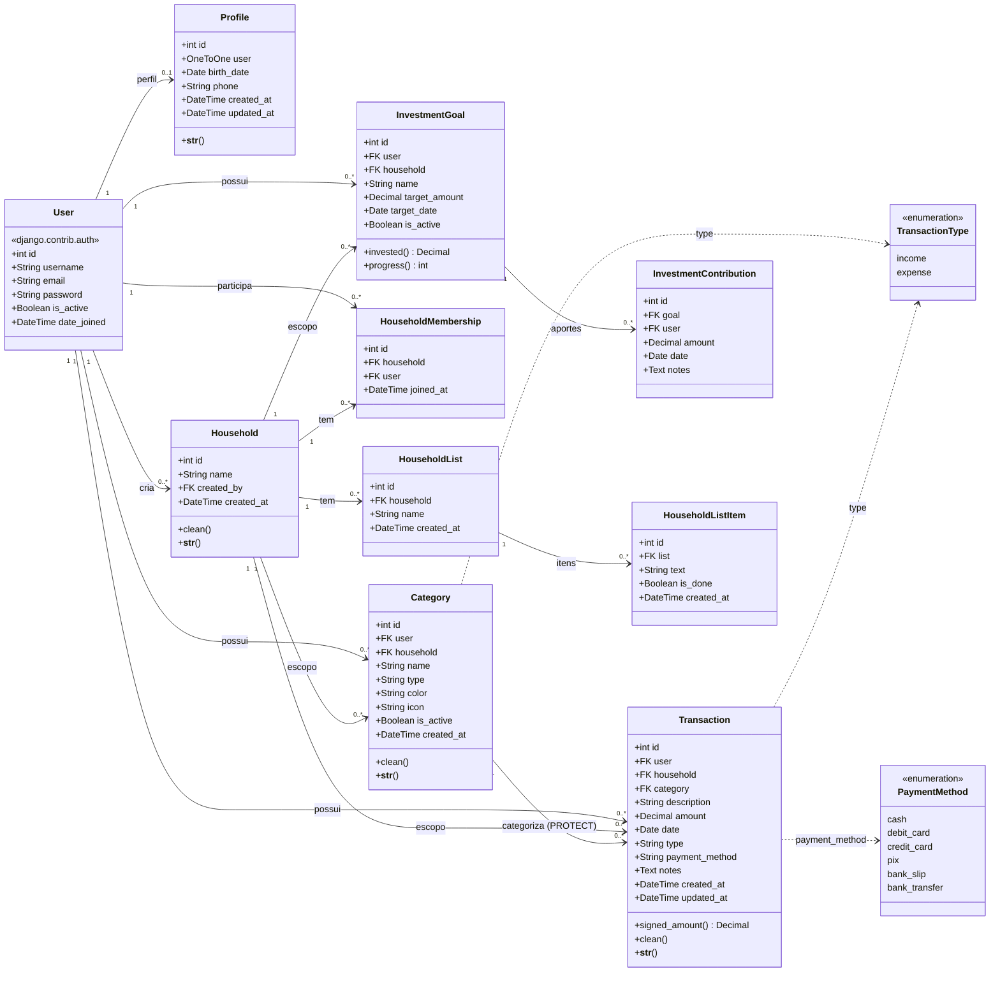
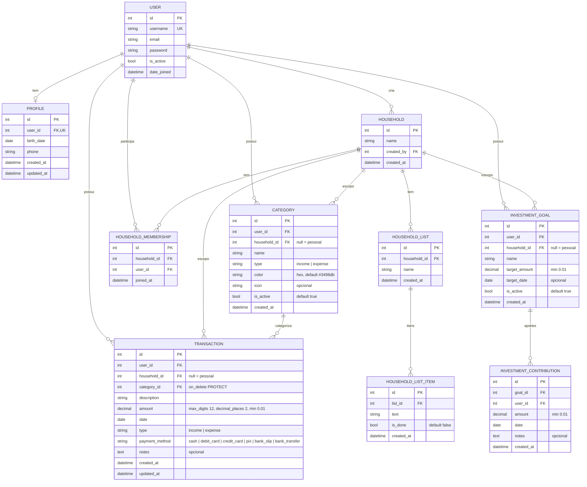

# PRD — Sistema Financeiro Pessoal ("Finances")

> Product Requirement Document
> Versão: 1.0 · Data: 2026-05-14 · Status: Em desenvolvimento

---

## 1. Visão geral

O **Finances** é uma aplicação web de finanças pessoais que permite a um usuário
registrar, categorizar e acompanhar suas receitas e despesas ao longo do tempo.
O sistema oferece um painel (dashboard) com o resumo financeiro do mês corrente,
gestão completa de transações e categorias, e isolamento de dados por escopo.
Cada conta tem finanças **pessoais** privadas e pode participar de **grupos**
(espaços compartilhados, ex.: a conta da casa de um casal), alternando entre os
escopos. O acesso é por **e-mail**.

O produto é construído sobre **Django 6** com renderização server-side
(Django Template Language) e estilização com **TailwindCSS**, usando o banco
**SQLite** em desenvolvimento.

---

## 2. Sobre o produto

| Atributo | Descrição |
|---|---|
| Nome | Finances |
| Tipo | Aplicação web (server-rendered) |
| Domínio | Finanças pessoais / controle de gastos |
| Modelo de uso | Multiusuário; finanças pessoais privadas + grupos compartilhados |
| Plataforma | Navegador desktop e mobile (responsivo) |
| Idioma da interface | Português (Brasil) |
| Idioma do código | Inglês |

O produto resolve o problema de pessoas que não têm visibilidade clara de para
onde o dinheiro está indo. Em vez de planilhas manuais, o Finances oferece um
fluxo rápido de lançamento e uma visão consolidada por categoria e por mês.

---

## 3. Propósito

Dar ao usuário **controle e clareza** sobre sua vida financeira pessoal por meio
de três capacidades centrais:

1. **Registrar** receitas e despesas com poucos cliques.
2. **Organizar** lançamentos em categorias customizáveis (com cor e ícone).
3. **Entender** o resultado do mês (entrou, saiu, saldo) de forma imediata.

O propósito não é substituir um sistema contábil completo, mas ser uma
ferramenta leve, rápida e de baixo atrito para o acompanhamento diário.

---

## 4. Público alvo

| Persona | Perfil | Necessidade principal |
|---|---|---|
| **Indivíduo organizando finanças** | Pessoa física, 20–45 anos, renda fixa ou variável, usa o celular no dia a dia | Saber quanto gastou no mês e em quê |
| **Autônomo / freelancer** | Recebe de múltiplas fontes, gastos misturados | Separar receitas por origem e despesas por tipo |
| **Casal / família (uso individual)** | Cada membro com sua conta | Registrar gastos pessoais sem expor a terceiros |
| **Estudante** | Orçamento apertado, controle de mesada/bolsa | Visualizar saldo restante e evitar estouro |

**Fora de escopo de público:** empresas, contabilidade fiscal, múltiplos
usuários sobre a mesma carteira (conta compartilhada).

---

## 5. Objetivos

### Objetivos de produto
- O1. Permitir o lançamento de uma transação em menos de 30 segundos.
- O2. Entregar uma visão consolidada do mês (receita, despesa, saldo) na home.
- O3. Garantir consistência dos dados: categoria e transação sempre coerentes.
- O4. Garantir privacidade: nenhum usuário acessa dados de outro.

### Objetivos de negócio
- O5. Validar a hipótese de que um app simples de lançamento manual gera
  retenção semanal.
- O6. Estabelecer uma base técnica escalável para evolução futura (relatórios,
  metas, API).

### Não-objetivos (v1)
- Integração bancária / Open Finance.
- Importação de extratos (CSV/OFX).
- Transações recorrentes automáticas.
- Multi-moeda.
- Relatórios gráficos avançados.

---

## 6. Requisitos funcionais

| ID | Requisito | Prioridade |
|---|---|---|
| RF01 | O usuário pode criar uma conta (username, e-mail, senha). | Alta |
| RF02 | O usuário pode autenticar-se (login) e encerrar a sessão (logout). | Alta |
| RF03 | Todas as telas de dados exigem autenticação. | Alta |
| RF04 | O usuário pode criar, listar, editar e excluir **categorias**. | Alta |
| RF05 | Categoria possui nome, tipo (receita/despesa), cor (hex), ícone e status ativo. | Alta |
| RF06 | O sistema impede categorias duplicadas por `(usuário, nome, tipo)`. | Média |
| RF07 | O usuário pode criar, listar, editar e excluir **transações**. | Alta |
| RF08 | Transação possui descrição, valor, data, tipo, método de pagamento, categoria e observações. | Alta |
| RF09 | O valor da transação deve ser maior que zero. | Alta |
| RF10 | O tipo da transação deve ser igual ao tipo da categoria selecionada. | Alta |
| RF11 | O seletor de categoria mostra apenas categorias ativas do próprio usuário. | Alta |
| RF12 | Uma categoria com transações vinculadas não pode ser excluída. | Média |
| RF13 | A listagem de transações pode ser filtrada por tipo (receita/despesa). | Média |
| RF14 | O dashboard exibe receita, despesa e saldo do mês corrente. | Alta |
| RF15 | O dashboard exibe as 10 transações mais recentes. | Média |
| RF16 | O administrador pode gerenciar todos os dados via Django Admin. | Média |
| RF17 | Mensagens de feedback (sucesso/erro) são exibidas após cada ação. | Média |
| RF18 | Após o cadastro, o usuário completa o perfil (nome, sobrenome, data de nascimento, telefone). | Alta |
| RF19 | Enquanto o perfil não estiver completo, o usuário autenticado é redirecionado para a tela de perfil. | Alta |
| RF20 | O usuário pode editar o perfil a qualquer momento. | Média |
| RF21 | O cadastro e o login são feitos por e-mail (gravado também como `username`). | Alta |
| RF22 | O usuário pode criar grupos e listar os grupos de que participa. | Alta |
| RF23 | O dono do grupo pode adicionar membros por e-mail e removê-los. | Alta |
| RF23a | O dono do grupo pode renomear e excluir o grupo; a exclusão (via confirmação) remove os dados do grupo para todos os membros. | Alta |
| RF24 | O usuário pode alternar o escopo ativo entre Pessoal e cada grupo. | Alta |
| RF25 | Dashboard, transações e categorias operam sempre no escopo ativo; dados pessoais ficam privados e dados de grupo são compartilhados entre os membros. | Alta |
| RF26 | Categorias e transações podem pertencer a um grupo (`household`) ou serem pessoais. | Alta |
| RF27 | O usuário pode criar objetivos de investimento (nome, meta de valor, prazo opcional), pessoais ou de grupo. | Média |
| RF28 | O usuário pode registrar aportes em um objetivo e acompanhar o progresso (soma dos aportes vs meta). | Média |
| RF29 | Os aportes do mês entram como saída de caixa no saldo do dashboard, mas a seção de investimentos é separada da lista de lançamentos. | Média |
| RF30 | Em grupo, os membros podem criar listas nomeadas (checklists) com itens marcáveis como concluídos. | Média |
| RF31 | O usuário pode navegar entre meses (incluindo futuros) no dashboard e na lista de lançamentos. | Alta |
| RF32 | Ao lançar, o usuário pode parcelar a compra em N vezes; o sistema gera uma saída em cada mês (valor total dividido). | Alta |
| RF33 | O usuário pode cadastrar contas fixas (recorrentes sem fim, ex.: aluguel) que aparecem automaticamente em cada mês até serem pausadas. | Alta |
| RF34 | O sistema exibe uma previsão dos próximos meses, considerando parcelas e contas fixas. | Média |

### 6.1 Flowchart Mermaid — fluxos de UX



---

## 7. Requisitos não-funcionais

| ID | Categoria | Requisito |
|---|---|---|
| RNF01 | Segurança | Senhas armazenadas com hash (PBKDF2, padrão Django). |
| RNF02 | Segurança | Proteção CSRF em todos os formulários POST. |
| RNF03 | Segurança | Isolamento de dados por escopo em todas as queries (`Model.objects.in_scope(request.user, household)`); pessoal privado, grupo restrito aos membros. |
| RNF04 | Segurança | Views de dados protegidas por `@login_required`. |
| RNF05 | Usabilidade | Interface responsiva (mobile-first) com TailwindCSS. |
| RNF06 | Usabilidade | Feedback visível em até 1 ação para sucesso/erro. |
| RNF07 | Desempenho | Páginas de listagem renderizadas em < 300 ms com até 1.000 registros. |
| RNF08 | Desempenho | Uso de `select_related` para evitar consultas N+1. |
| RNF09 | Integridade | Validações de domínio centralizadas em `Model.clean()`. |
| RNF10 | Integridade | Constraints de banco para unicidade e proteção referencial. |
| RNF11 | Manutenibilidade | Código em inglês, seguindo convenções Django. |
| RNF12 | Manutenibilidade | Separação clara: models, forms, views, templates, urls. |
| RNF13 | Portabilidade | Compatível com SQLite (dev) e PostgreSQL (produção, via `DATABASE_URL`). |
| RNF14 | Acessibilidade | Contraste mínimo AA, labels associados a inputs, navegação por teclado. |
| RNF15 | Observabilidade | `python manage.py check` sem erros antes de cada release. |
| RNF16 | Acesso | Usuário autenticado sem perfil completo é redirecionado para a tela de perfil (`ProfileCompletionMiddleware`). |

---

## 8. Arquitetura técnica

### 8.1 Stack

| Camada | Tecnologia | Observação |
|---|---|---|
| Linguagem | Python 3.14 | |
| Framework web | Django 6.0.5 | MVT, server-rendered |
| Templates | Django Template Language | Sem SPA |
| Estilização | TailwindCSS v4 | `django-tailwind` 4.x no modo standalone (`pytailwindcss`) — sem Node.js. Instalado e configurado. |
| Autenticação | `django.contrib.auth` | `User` nativo |
| Banco (dev) | SQLite 3 | `db.sqlite3` |
| Banco (produção) | PostgreSQL | Via `DATABASE_URL` + `dj-database-url`; mesmo ORM, sem mudança de modelo |
| Admin | `django.contrib.admin` | Gestão interna |
| Servidor (dev) | `runserver` | |
| Servidor (produção) | Gunicorn + WhiteNoise | WSGI; estáticos servidos pelo WhiteNoise (sem Nginx) |
| Container / deploy | Docker (multi-stage) no Railway | `Dockerfile` + `railway.json`; push na `main` dispara o rebuild |

**Organização do projeto:**

```
emy/
├── core/                 # Projeto Django (settings, urls, wsgi/asgi)
├── finances/             # App de domínio
│   ├── models.py         # Category, Transaction, Profile, enums
│   ├── forms.py          # CategoryForm, TransactionForm, ProfileForm
│   ├── views.py          # Dashboard, CRUD, auth (register), profile_edit
│   ├── middleware.py     # ProfileCompletionMiddleware
│   ├── admin.py          # Registros no Django Admin
│   ├── urls.py           # Rotas do app
│   ├── migrations/
│   └── templates/        # base.html, finances/, registration/
├── theme/                # App do django-tailwind (fonte + build do CSS)
├── docs/                 # Documentação de guidelines e padrões
├── Dockerfile            # Imagem multi-stage (builder + runtime non-root)
├── entrypoint.sh         # migrate no start + handoff para o gunicorn
├── docker-compose.yml    # Stack local: web (gunicorn) + db (PostgreSQL)
├── railway.json          # Config de build/healthcheck do Railway
├── manage.py
├── requirements.txt
└── db.sqlite3
```

### 8.2 Estrutura de dados — schemas Mermaid

**Diagrama de classes**



**Diagrama entidade-relacionamento**



**Regras de integridade**
- `Category`: unicidade por escopo → `unique_personal_category` `(user, name, type)`
  quando pessoal e `unique_household_category` `(household, name, type)` quando do grupo.
- `Transaction.category`: `on_delete=PROTECT` → categoria em uso não é excluída.
- `Transaction.amount`: `MinValueValidator(0.01)`.
- `Transaction.clean()`: coerência categoria/escopo (grupo ou pessoal) e
  `category.type == transaction.type`.
- `Category.color`: `RegexValidator` de hex (`#rgb` ou `#rrggbb`).
- `Profile.user`: `OneToOneField` → um perfil por usuário.
- `Profile.phone`: `RegexValidator` de telefone.
- `HouseholdMembership`: `UniqueConstraint(household, user)` → uma membership por par.
- `Category.household` / `Transaction.household`: FK anulável → nulo = pessoal,
  preenchido = compartilhado no grupo.
- `InvestmentGoal.target_amount` / `InvestmentContribution.amount`:
  `MinValueValidator(0.01)`. `InvestmentGoal.household` anulável (pessoal/grupo);
  os aportes do mês no escopo entram como saída no saldo do dashboard.
- `HouseholdList.household`: FK obrigatória → listas existem só em grupo.

---

## 9. Design system

> Implementação: classes utilitárias do **TailwindCSS** aplicadas diretamente
> no **Django Template Language**. Os tokens de design vivem no bloco `@theme`
> de `theme/static_src/src/styles.css`.
>
> **Status:** os templates foram migrados da v1 (CSS inline) para a identidade
> visual **Emy — variação "Petal"**, escolhida entre três explorações de
> design (Soft Bloom / Petal / Aurora). O bloco `<style>` inline foi removido
> do `base.html`; toda a estilização é via classes Tailwind + tokens `emy-*`.
> A migração cobriu apenas as telas com model atual (`Category` /
> `Transaction`) — features do mock sem model (Cartões, Metas, Insights,
> Transferência, Recorrência) ficaram fora. **A fonte de verdade do design
> implementado são os próprios templates**; as tabelas abaixo descrevem os
> tokens e os princípios da variação Petal.

### 9.1 Personalidade — "Petal"

Off-white rosado, soft/feminino com glow, cards bem arredondados, gradiente
rosa→roxo em botões e destaques, nav inferior flutuante, tom motivacional e
íntimo na escrita da interface.

### 9.2 Cores (tokens `@theme`)

| Token | Hex | Uso |
|---|---|---|
| `emy-bg` / `emy-bg-warm` / `emy-bg-deep` | `#FBF3F1` / `#F6E9E4` / `#F3DDDB` | Fundos off-white rosados |
| `emy-surface` | `#FFFFFF` | Cards, formulários |
| `emy-ink` / `emy-ink-soft` / `emy-ink-mute` | `#2A1A36` / `#5E4861` / `#8B7A8E` | Texto (principal → auxiliar) |
| `emy-line` / `emy-line-2` | `rgba(42,26,54,.08)` / `.14` | Divisórias, contornos |
| `emy-pink-50..700` | `#FDF2F8` … `#BE185D` | Marca (rosa), `emy-pink-500 = #EC4899` |
| `emy-purple-50..700` | `#F5F3FF` … `#6D28D9` | Marca (roxo), `emy-purple-500 = #8B5CF6` |
| `emy-good` | `#10B981` | Receita, sucesso |
| `emy-bad` | `#E11D48` | Despesa, erro, ações destrutivas |

Gradiente de marca: `bg-gradient-to-br from-emy-pink-500 to-emy-purple-500`.

### 9.3 Tipografia (tokens `@theme`)

| Token | Fonte | Uso |
|---|---|---|
| `font-sans` | Plus Jakarta Sans | Corpo e títulos (família base) |
| `font-serif` | Instrument Serif | Destaques editoriais |
| `font-script` | Caveat | Toques manuscritos |

Títulos de página: `text-3xl font-extrabold tracking-tight`. Auxiliar:
`text-xs text-emy-ink-mute uppercase tracking-wider`.

### 9.4 Princípios de componentes

- **Botões / destaques primários:** gradiente rosa→roxo, `rounded-full` ou
  `rounded-2xl`, texto branco, sombra suave.
- **Cards:** `bg-emy-surface`, cantos bem arredondados (`rounded-[1.5rem]` a
  `rounded-[2.5rem]`), sombra difusa (`shadow-[...]`).
- **Inputs:** `rounded-2xl bg-emy-bg`, foco em `ring-2 ring-emy-pink-400`.
  Formulários renderizam campo a campo; `type` e `category` viram radios
  estilizados (toggle / pills).
- **Layout (app shell):** a página é fixa em `100dvh` e não rola; só a área de
  conteúdo rola por dentro, sem barra visível (`.no-scrollbar`). Mobile-first
  com `dvh`.
- **Navegação (dois menus):** seletor de escopo (dropdown Pessoal/grupos) no
  topo; nav inferior flutuante de ícones, pílula branca com blur, item ativo em
  gradiente de marca (mobile e desktop).
- **Desktop 50/50:** a partir de `lg:`, as telas usam duas colunas
  (`lg:grid-cols-2`); o dashboard usa cards de stat (`lg:grid-cols-4`); os forms
  usam card dividido (painel de gradiente + campos). Mobile em coluna única.
- **Telas de auth e forms:** card dividido — painel de gradiente claro de um
  lado, conteúdo do outro.

> Os valores exatos de classe não são versionados aqui (são frágeis de
> manter) — consultar os templates em `finances/templates/` para o detalhe.

---

## 10. User stories

### Épico 1 — Autenticação e conta

> Como visitante, quero criar uma conta e autenticar-me, para acessar meus
> dados financeiros de forma privada.

- **US1.1** — Como visitante, quero me cadastrar com usuário e senha.
  - Critérios de aceite:
    - [ ] Formulário valida senha conforme `AUTH_PASSWORD_VALIDATORS`.
    - [ ] Username duplicado é rejeitado com mensagem clara.
    - [ ] Após o cadastro, o usuário é autenticado automaticamente e
          redirecionado ao dashboard.
- **US1.2** — Como usuário, quero fazer login.
  - Critérios de aceite:
    - [ ] Credenciais inválidas exibem erro sem revelar qual campo falhou.
    - [ ] Login bem-sucedido redireciona ao dashboard.
- **US1.3** — Como usuário, quero encerrar minha sessão.
  - Critérios de aceite:
    - [ ] Logout só ocorre via POST (proteção CSRF).
    - [ ] Após logout, o usuário é redirecionado ao login.
- **US1.4** — Como usuário não autenticado, não quero acessar telas de dados.
  - Critérios de aceite:
    - [ ] Acesso a `/`, `/transactions/`, `/categories/` redireciona ao login
          com `?next=`.
- **US1.5** — Como usuário recém-cadastrado, quero completar meu perfil com
  nome, data de nascimento e telefone.
  - Critérios de aceite:
    - [ ] Após o cadastro, sou levado à tela de perfil.
    - [ ] Enquanto o perfil não estiver completo, sou redirecionado a ele em
          qualquer rota (exceto `/admin/`, a própria tela de perfil e o logout).
    - [ ] `data de nascimento` e `telefone` são obrigatórios.
- **US1.6** — Como usuário, quero editar meu perfil a qualquer momento.
  - Critérios de aceite:
    - [ ] A tela de perfil é acessível pelo nome do usuário no header.
    - [ ] O nome (`first_name`/`last_name`) é gravado no `User` nativo.

### Épico 2 — Gestão de categorias

> Como usuário, quero gerenciar categorias, para classificar minhas transações.

- **US2.1** — Como usuário, quero criar uma categoria.
  - Critérios de aceite:
    - [ ] Campos: nome, tipo, cor, ícone, ativo.
    - [ ] Cor inválida (não-hex) é rejeitada.
    - [ ] Categoria `(usuário, nome, tipo)` duplicada é rejeitada.
- **US2.2** — Como usuário, quero listar minhas categorias.
  - Critérios de aceite:
    - [ ] A lista mostra apenas categorias do próprio usuário.
    - [ ] Exibe nome, tipo, cor, ícone e status ativo.
- **US2.3** — Como usuário, quero editar uma categoria.
  - Critérios de aceite:
    - [ ] Não é possível editar categoria de outro usuário (404).
- **US2.4** — Como usuário, quero excluir uma categoria sem transações.
  - Critérios de aceite:
    - [ ] Categoria com transações vinculadas exibe erro e não é excluída.
    - [ ] Exclusão exige confirmação via POST.

### Épico 3 — Gestão de transações

> Como usuário, quero registrar e manter minhas receitas e despesas.

- **US3.1** — Como usuário, quero criar uma transação.
  - Critérios de aceite:
    - [ ] Campos: descrição, valor, data, tipo, categoria, método, observações.
    - [ ] Valor ≤ 0 é rejeitado.
    - [ ] O seletor de categoria mostra só categorias ativas do usuário.
    - [ ] Tipo da transação diferente do tipo da categoria é rejeitado.
- **US3.2** — Como usuário, quero listar minhas transações.
  - Critérios de aceite:
    - [ ] Ordenadas por data decrescente.
    - [ ] Filtro por tipo (receita/despesa/todas).
- **US3.3** — Como usuário, quero editar uma transação.
  - Critérios de aceite:
    - [ ] Não é possível editar transação de outro usuário (404).
- **US3.4** — Como usuário, quero excluir uma transação.
  - Critérios de aceite:
    - [ ] Exclusão exige confirmação via POST.

### Épico 4 — Dashboard e visão consolidada

> Como usuário, quero ver o resumo do meu mês para entender minha situação.

- **US4.1** — Como usuário, quero ver receita, despesa e saldo do mês corrente.
  - Critérios de aceite:
    - [ ] Os totais consideram apenas o mês/ano atuais do usuário.
    - [ ] Saldo = receita − despesa.
- **US4.2** — Como usuário, quero ver minhas transações mais recentes.
  - Critérios de aceite:
    - [ ] Lista as 10 últimas transações com categoria e valor sinalizado.

### Épico 5 — Administração

> Como administrador, quero gerenciar todos os dados do sistema.

- **US5.1** — Como administrador, quero acessar o Django Admin.
  - Critérios de aceite:
    - [ ] `Category` e `Transaction` registrados com filtros e busca.

---

## 11. Métricas de sucesso

### KPIs de produto
| KPI | Meta | Como medir |
|---|---|---|
| Tempo médio de lançamento de transação | < 30 s | Instrumentação no form / teste de usabilidade |
| Taxa de erro de validação no formulário | < 15% das submissões | Logs de `form.is_valid() == False` |
| Disponibilidade | ≥ 99% | Monitoramento de uptime |

### KPIs de usuário / engajamento
| KPI | Meta | Como medir |
|---|---|---|
| Usuários ativos semanais (WAU) | Crescimento MoM positivo | Login + ao menos 1 transação na semana |
| Retenção D7 | ≥ 30% | Coorte de cadastro |
| Transações por usuário ativo / semana | ≥ 5 | Contagem de `Transaction` |
| Categorias criadas por usuário | ≥ 3 na 1ª semana | Contagem de `Category` |
| Taxa de uso do dashboard | ≥ 60% das sessões | Acesso à rota `/` |

### KPIs técnicos / qualidade
| KPI | Meta | Como medir |
|---|---|---|
| Cobertura de testes | ≥ 70% | `coverage` |
| Tempo de resposta P95 (listagens) | < 300 ms | Profiling / APM |
| Bugs em produção por release | < 3 | Tracker de issues |

---

## 12. Riscos e mitigações

| ID | Risco | Prob. | Impacto | Mitigação |
|---|---|---|---|---|
| R01 | Lançamento manual gera atrito e abandono | Alta | Alto | Formulário curto, valores padrão, lançamento rápido a partir do dashboard |
| R02 | Inconsistência tipo categoria × transação confunde o usuário | Média | Médio | Validação em `clean()` + filtro do seletor + mensagens claras |
| R03 | Vazamento de dados entre usuários | Baixa | Crítico | `@login_required` + `filter(user=request.user)` em todas as queries + testes de isolamento |
| R04 | Crescimento de dados degrada listagens | Média | Médio | `select_related`, paginação, índices; migração futura a PostgreSQL |
| R05 | Exclusão de categoria em uso quebra integridade | Baixa | Alto | `on_delete=PROTECT` + checagem na view com feedback |
| R06 | `SECRET_KEY` e `DEBUG=True` indo a produção | Média | Crítico | Variáveis de ambiente, settings separados por ambiente, checklist de deploy |
| R07 | Migração de CSS inline para TailwindCSS introduz regressões visuais | Média | Médio | Migrar tela a tela, revisão visual, manter base de componentes |
| R08 | Falta de testes automatizados atrasa evolução | Média | Médio | Suíte de testes desde a Sprint 1, CI bloqueando merge |
| R09 | Senhas fracas dos usuários | Média | Médio | `AUTH_PASSWORD_VALIDATORS` ativos, orientação no cadastro |
| R10 | Escopo crescer para "app de banco" | Alta | Médio | Não-objetivos explícitos no PRD, revisão de escopo por sprint |

---

## 13. Lista de tarefas

> Checklist por sprint. Marque `[x]` ao concluir cada subtarefa; a tarefa só é
> considerada concluída quando todas as suas subtarefas estiverem marcadas.

### Sprint 0 — Fundação do projeto

- [ ] **T0.1 — Configurar ambiente e projeto Django**
  - [ ] T0.1.1 — Criar/validar virtualenv `.venv` e `requirements.txt`
        (Django 6.0.5, asgiref, sqlparse, django-tailwind, pytailwindcss).
  - [ ] T0.1.2 — Validar projeto `core` (settings, urls, wsgi/asgi) e
        `manage.py`.
  - [ ] T0.1.3 — Criar app `finances` e registrá-lo em `INSTALLED_APPS`.
  - [ ] T0.1.4 — Definir `DEFAULT_AUTO_FIELD = BigAutoField`.
  - [ ] T0.1.5 — Rodar `python manage.py check` sem erros.
- [ ] **T0.2 — Configurar controle de versão e qualidade**
  - [ ] T0.2.1 — Inicializar repositório git e `.gitignore`
        (`.venv/`, `db.sqlite3`, `__pycache__/`, `*.pyc`,
        `theme/static/css/dist/`).
  - [ ] T0.2.2 — Adicionar `requirements.txt` com versões fixadas.
  - [ ] T0.2.3 — Definir convenção de commits e branch padrão.
- [ ] **T0.3 — Configurações de ambiente**
  - [ ] T0.3.1 — Extrair `SECRET_KEY`, `DEBUG`, `ALLOWED_HOSTS` para variáveis
        de ambiente.
  - [ ] T0.3.2 — Documentar variáveis necessárias em `README`/`.env.example`.

### Sprint 1 — Modelagem de dados e domínio

- [ ] **T1.1 — Enums de domínio**
  - [ ] T1.1.1 — Criar `TransactionType` (`income`, `expense`) como
        `TextChoices`.
  - [ ] T1.1.2 — Criar `PaymentMethod` (`cash`, `debit_card`, `credit_card`,
        `pix`, `bank_slip`, `bank_transfer`) como `TextChoices`.
- [ ] **T1.2 — Model `Category`**
  - [ ] T1.2.1 — Campos: `user` (FK CASCADE), `name`, `type`, `color`, `icon`,
        `is_active`, `created_at`.
  - [ ] T1.2.2 — `RegexValidator` de cor hex em `color` (default `#3498db`).
  - [ ] T1.2.3 — `Meta`: `ordering`, `verbose_name_plural`,
        `UniqueConstraint(user, name, type)`.
  - [ ] T1.2.4 — `__str__()` e `clean()` (trim de nome, rejeitar nome vazio).
- [ ] **T1.3 — Model `Transaction`**
  - [ ] T1.3.1 — Campos: `user` (FK CASCADE), `category` (FK PROTECT),
        `description`, `amount`, `date`, `type`, `payment_method`, `notes`,
        `created_at`, `updated_at`.
  - [ ] T1.3.2 — `amount` como `DecimalField(12, 2)` com
        `MinValueValidator(0.01)`.
  - [ ] T1.3.3 — `Meta.ordering` por `-date`, `-created_at`.
  - [ ] T1.3.4 — `clean()`: validar `category.user == user`.
  - [ ] T1.3.5 — `clean()`: validar `category.type == type`.
  - [ ] T1.3.6 — Propriedade `signed_amount` (negativo p/ despesa).
  - [ ] T1.3.7 — `__str__()`.
- [ ] **T1.4 — Migrations**
  - [ ] T1.4.1 — `makemigrations finances`.
  - [ ] T1.4.2 — `migrate` e validar criação das tabelas/constraints.
- [ ] **T1.5 — Testes de modelo**
  - [ ] T1.5.1 — Teste: transação válida persiste; `signed_amount` correto.
  - [ ] T1.5.2 — Teste: `amount <= 0` levanta `ValidationError`.
  - [ ] T1.5.3 — Teste: tipo categoria ≠ tipo transação levanta erro.
  - [ ] T1.5.4 — Teste: categoria de outro usuário levanta erro.
  - [ ] T1.5.5 — Teste: `UniqueConstraint` de categoria duplicada.
  - [ ] T1.5.6 — Teste: `PROTECT` impede exclusão de categoria com transação.

### Sprint 2 — Autenticação e acesso

- [ ] **T2.1 — Rotas de autenticação**
  - [ ] T2.1.1 — Incluir `django.contrib.auth.urls` em `core/urls.py`.
  - [ ] T2.1.2 — Configurar `LOGIN_URL`, `LOGIN_REDIRECT_URL`,
        `LOGOUT_REDIRECT_URL`.
- [ ] **T2.2 — Cadastro de usuário**
  - [ ] T2.2.1 — View `register` usando `UserCreationForm`.
  - [ ] T2.2.2 — Login automático e redirecionamento pós-cadastro.
  - [ ] T2.2.3 — Redirecionar usuário já autenticado para o dashboard.
  - [ ] T2.2.4 — Rota `/accounts/register/`.
- [ ] **T2.3 — Proteção de acesso**
  - [ ] T2.3.1 — Aplicar `@login_required` em todas as views de dados.
  - [ ] T2.3.2 — Garantir redirecionamento com `?next=` para anônimos.
- [ ] **T2.4 — Testes de autenticação**
  - [ ] T2.4.1 — Teste: cadastro válido cria usuário e autentica.
  - [ ] T2.4.2 — Teste: login/logout funcionam.
  - [ ] T2.4.3 — Teste: anônimo é redirecionado das rotas protegidas.

### Sprint 3 — CRUD de categorias

- [ ] **T3.1 — Formulário de categoria**
  - [ ] T3.1.1 — `CategoryForm` (`name`, `type`, `color`, `icon`, `is_active`).
  - [ ] T3.1.2 — Widget `type=color` para `color`.
- [ ] **T3.2 — Views de categoria**
  - [ ] T3.2.1 — `category_list` filtrando por `request.user`.
  - [ ] T3.2.2 — `category_create` atribuindo `user` antes de salvar.
  - [ ] T3.2.3 — `category_update` com `get_object_or_404(..., user=request.user)`.
  - [ ] T3.2.4 — `category_delete` bloqueando exclusão se houver transações.
  - [ ] T3.2.5 — Mensagens de sucesso/erro via `django.contrib.messages`.
- [ ] **T3.3 — Rotas de categoria**
  - [ ] T3.3.1 — `urls.py`: list, new, edit, delete.
- [ ] **T3.4 — Testes de categoria**
  - [ ] T3.4.1 — Teste: CRUD completo do dono.
  - [ ] T3.4.2 — Teste: acesso a categoria de outro usuário retorna 404.
  - [ ] T3.4.3 — Teste: exclusão bloqueada com transações vinculadas.

### Sprint 4 — CRUD de transações

- [ ] **T4.1 — Formulário de transação**
  - [ ] T4.1.1 — `TransactionForm` com todos os campos editáveis.
  - [ ] T4.1.2 — Receber `user` no `__init__` e filtrar `category` por
        categorias ativas do usuário.
  - [ ] T4.1.3 — Atribuir `instance.user` em `clean()` para validações de modelo.
  - [ ] T4.1.4 — Widgets: `date` (`type=date`), `amount` (`step=0.01`),
        `notes` (textarea).
- [ ] **T4.2 — Views de transação**
  - [ ] T4.2.1 — `transaction_list` com `select_related('category')`.
  - [ ] T4.2.2 — Filtro por tipo via querystring `?type=`.
  - [ ] T4.2.3 — `transaction_create`.
  - [ ] T4.2.4 — `transaction_update` restrito ao dono.
  - [ ] T4.2.5 — `transaction_delete` com confirmação.
  - [ ] T4.2.6 — Mensagens de feedback em todas as ações.
- [ ] **T4.3 — Rotas de transação**
  - [ ] T4.3.1 — `urls.py`: list, new, edit, delete.
- [ ] **T4.4 — Testes de transação**
  - [ ] T4.4.1 — Teste: criação válida via POST redireciona e persiste.
  - [ ] T4.4.2 — Teste: seletor de categoria não mostra categorias de outro
        usuário nem inativas.
  - [ ] T4.4.3 — Teste: filtro por tipo retorna o subconjunto correto.
  - [ ] T4.4.4 — Teste: edição/exclusão de transação de terceiros retorna 404.

### Sprint 5 — Dashboard

- [ ] **T5.1 — View do dashboard**
  - [ ] T5.1.1 — Calcular receita e despesa do mês corrente com
        `aggregate(Sum('amount'))`.
  - [ ] T5.1.2 — Calcular saldo (receita − despesa) tratando `None` como zero.
  - [ ] T5.1.3 — Buscar as 10 transações mais recentes com `select_related`.
- [ ] **T5.2 — Testes do dashboard**
  - [ ] T5.2.1 — Teste: totais consideram só o mês/ano atuais.
  - [ ] T5.2.2 — Teste: totais consideram só o usuário logado.
  - [ ] T5.2.3 — Teste: lista de recentes limitada a 10.

### Sprint 6 — Django Admin

- [ ] **T6.1 — Registro de modelos no Admin**
  - [ ] T6.1.1 — `CategoryAdmin`: `list_display`, `list_filter`,
        `search_fields`, `autocomplete_fields`.
  - [ ] T6.1.2 — `TransactionAdmin`: `list_display`, `list_filter`,
        `search_fields`, `autocomplete_fields`, `date_hierarchy`.
  - [ ] T6.1.3 — Criar superusuário de desenvolvimento.

### Sprint 7 — Interface e Design System (TailwindCSS)

- [ ] **T7.1 — Integração do TailwindCSS**
  - [x] T7.1.1 — Instalar e configurar Tailwind. Feito: `django-tailwind` 4.x +
        `pytailwindcss` (modo standalone, sem Node.js); app `theme` criado;
        `INSTALLED_APPS` + `TAILWIND_APP_NAME` configurados; `base.html` carrega
        ``.
  - [x] T7.1.2 — Configurar `@source` apontando para os templates. Feito: a
        diretiva `@source "../../../**/*.{html,py,js}"` em
        `theme/static_src/src/styles.css` escaneia todo o projeto.
  - [ ] T7.1.3 — Definir camada `@layer components` com classes recorrentes
        (`.btn`, `.card`, `.input`) em `theme/static_src/src/styles.css`.
  - [ ] T7.1.4 — Adicionar `theme/static/css/dist/` ao `.gitignore` e garantir
        `tailwind build` no pipeline de deploy.
- [ ] **T7.2 — Layout base**
  - [x] T7.2.1 — `base.html` com header, navegação e bloco de mensagens.
        Feito: header (logo Emy + usuário + Sair), nav inferior flutuante,
        bloco de mensagens; `<style>` inline da v1 removido.
  - [x] T7.2.2 — Aplicar tokens do design system (cores, tipografia, grids).
        Feito: tokens `emy-*` e fontes via `@theme` em `styles.css`.
  - [ ] T7.2.3 — Garantir responsividade mobile-first.
- [x] **T7.3 — Telas de autenticação**
  - [x] T7.3.1 — `registration/login.html`.
  - [x] T7.3.2 — `registration/register.html`.
- [x] **T7.4 — Telas de categoria**
  - [x] T7.4.1 — `finances/category_list.html` (grid de cards + ações).
  - [x] T7.4.2 — `finances/category_form.html`.
- [x] **T7.5 — Telas de transação**
  - [x] T7.5.1 — `finances/transaction_list.html` (lista + filtros por tipo).
  - [x] T7.5.2 — `finances/transaction_form.html`.
  - [x] T7.5.3 — `finances/confirm_delete.html` (reuso categoria + transação).
- [x] **T7.6 — Dashboard**
  - [x] T7.6.1 — `finances/dashboard.html` com card de saldo (gradiente) e
        lista de recentes. Pendente: bloco "gastos por categoria" (donut +
        lista) — exige agregado por categoria na `dashboard` view.
  - [x] T7.6.2 — Sinalização visual de valores (verde/vermelho).
- [ ] **T7.7 — Componentização**
  - [ ] T7.7.1 — Extrair partials reutilizáveis (`_messages.html`,
        `_form_field.html`).
  - [ ] T7.7.2 — Revisão visual de acessibilidade (contraste, foco, labels).

### Sprint 8 — Qualidade, segurança e entrega

- [ ] **T8.1 — Suíte de testes e cobertura**
  - [ ] T8.1.1 — Configurar `coverage` e meta mínima de 70%.
  - [ ] T8.1.2 — Teste end-to-end de isolamento de dados entre usuários.
- [ ] **T8.2 — Segurança**
  - [ ] T8.2.1 — Revisar CSRF em todos os formulários.
  - [ ] T8.2.2 — Settings separados por ambiente (`dev`/`prod`).
  - [ ] T8.2.3 — `DEBUG=False`, `ALLOWED_HOSTS` e `SECRET_KEY` via ambiente em
        produção.
- [ ] **T8.3 — Desempenho**
  - [ ] T8.3.1 — Adicionar paginação às listagens.
  - [ ] T8.3.2 — Revisar consultas N+1 com `select_related`.
  - [ ] T8.3.3 — Avaliar índices em `date`, `type`, `category`.
- [ ] **T8.4 — Documentação e deploy**
  - [ ] T8.4.1 — `README` com setup, execução e variáveis de ambiente.
  - [ ] T8.4.2 — `CLAUDE.md` com convenções do projeto.
  - [ ] T8.4.3 — Pipeline de CI rodando `check` + testes.
  - [x] T8.4.4 — Roteiro de deploy. Feito: containerizado (`Dockerfile`
        multi-stage) com Gunicorn + WhiteNoise + PostgreSQL, deploy no Railway
        (`railway.json`); passo a passo em `docs/getting-started.md`.

### Backlog futuro (pós-v1)

- [ ] **B1 — Relatórios** — gráficos de despesa por categoria e evolução mensal.
- [ ] **B2 — Transações recorrentes** — lançamentos automáticos por periodicidade.
- [ ] **B3 — Metas/orçamento** — limites por categoria com alerta de estouro.
- [ ] **B4 — Importação** — upload de extratos CSV/OFX.
- [ ] **B5 — API REST** — exposição via Django REST Framework para front separado.
- [ ] **B6 — Exportação** — download de transações em CSV/PDF.
```
